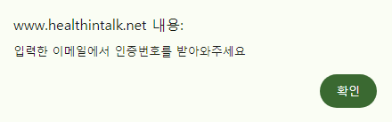
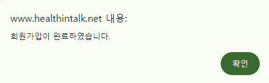
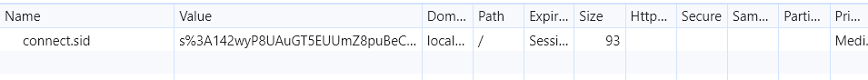
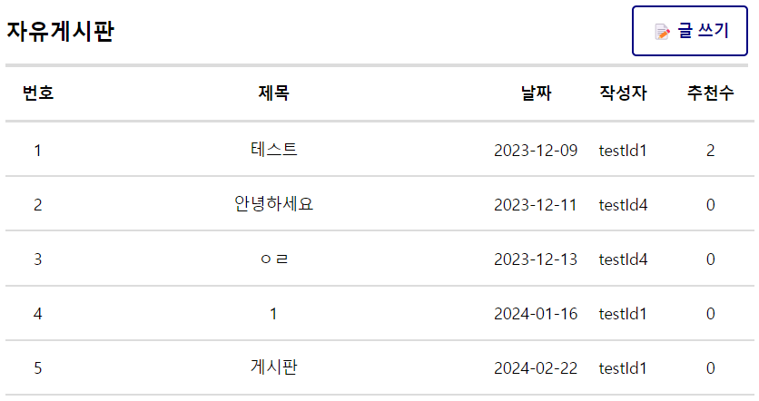
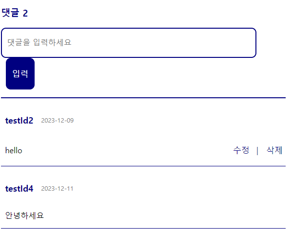
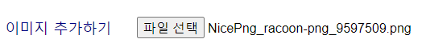
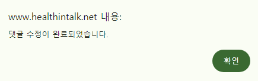

# 헬스인톡

## 프로젝트 소개

### 개발 목적
- 헬스를 처음 접하는 사람들 또는 혼자 헬스를 하는 사람들이 쉽고 올바른 방식으로 헬스를 이용할 수 있도록 정보 제공 및 여러 사람과 운동 방식 소통 & 공유를 통한 다양한 운동법을 접할 수 있는 공간 마련하기 위함

### 참여 인원
- 팀 **꼬**리의 **꼬**리를 무는 **헬**스 이야기(김광민, [김형준](https://github.com/mikejigglypuff), [오성훈](https://github.com/castlehuni))

### 개발 기간
- 1차 개발 기간 23.03 ~ 23.06
- 최종 개발 기간 23.09 ~ 24.02

### 사이트 경로
- [헬스인톡](www.healthintalk.net) 

## 구현 기능
### 회원가입 & 이메일 인증

기본 정보들을 입력하고 이메일 인증을 통해 회원가입할 수 있다.


중복된 아이디인지 먼저 검증해 새 아이디만 사용할 수 있도록 하였다.


이메일 인증 버튼 클릭 시 이메일 주소를 사용하는 회원이 존재하는지 확인 후 없다면 아래와 같이 토큰을 발급하고 해당 주소로 인증 메일이 전송된다.





인증번호를 입력하고 회원가입을 할 수 있다.


회원의 정보 중 비밀번호는 유출 시에도 비교적 안전하도록 해시 알고리즘을 적용 후 저장한다.


### 로그인
아이디와 비밀번호를 입력해 로그인할 수 있다.


이 때 서버 상에 로그인 세션이 생성되며 클라이언트에 쿠키가 발급된다.



또한 드롭다운 메뉴가 로그인 대신 마이페이지/로그아웃으로 바뀐다.


로그아웃 시 드롭다운이 초기 상태로 바뀐다.


### 커뮤니티 기능
메인화면의 게시글을 클릭하거나 헤더의 게시판을 클릭해 게시글 및 댓글을 확인할 수 있다.






로그인 후 게시글을 작성할 수 있다.


아래와 같은 이미지를 추가해서 작성하는 것도 가능하다.



작성된 게시글 결과는 아래와 같다.


게시글 화면에서 버튼을 클릭해 자신이 작성한 글을 수정 또는 삭제 가능하다.


게시글 버튼을 클릭해 게시글을 추천할 수 있고 한 번 더 클릭 시 추천을 취소할 수 있다.


다른 사람이 작성한 게시물은 수정 및 삭제할 수 없다.


로그인 후 댓글 작성 및 수정, 삭제할 수 있다.





### 다이어리
로그인 후 마이페이지에서 자신의 다이어리를 작성할 수 있다.


이 때 날짜, 몸무게를 제외한 다른 사항들은 입력하지 않아도 상관없다.


또한 작성한 다이어리들을 확인할 수 있다.


### 기타 기능
주소를 입력해 해당 주소 상에 존재하는 헬스장 목록을 확인할 수 있다.


키와 몸무게를 입력해 아래와 같이 bmi 계산 결과를 얻을 수 있다.


버튼을 클릭해 임의의 운동 부위를 추천받을 수 있다.


## 진행한 문서 작업

- [프로젝트 작업 관리](https://hypnotic-smoke-0d2.notion.site/3ce9d5c6bc644660850f46176c6e64bf?v=c2bb2aefd70f4a3380fb3342bddeec19&pvs=4)
- [API 문서](https://hypnotic-smoke-0d2.notion.site/API-a69e1f251feb4954bb98ae3addc15c43?pvs=4)
- [ERD 다이어그램](document/media/ERD.png)


## 설치 방법

- TLS 인증서가 요구됨
  
```
git clone
cd server
npm install
cd ../resources/frontend
npm run build
cd ../../server
mkdir config
```

아래와 같이 형식에 맞춰 JSON 파일 작성
```
config.json
{
  development: {
    "username": [DB 사용자],
    "password": [DB 패스워드],
    "database": [DB 이름],
    "host": [DB 호스트],
    "port": [DB 포트],
    "dialect": [DB 종류],
    "httpPort": [http 포],
    "httpsPort": [https 포트],
    "key": [인증서 key 경로],
    "cert": [인증서 cert 경로],
    "ca": [인증서 ca 경로],
  }
}

mail.json
{
  "service": [사용할 메일 서비스],
  "user": [메일 계정 아이디],
  "pass": [메일 계정 패스워드],
  "port": [메일 서비스가 지원하는 포트]
}

session.json
{
  "key": [세션 키],
  "salt": [salt 값],
  "iterations": [해시 반복 횟수],
  "len": [해시값 길이],
  "hash": [사용할 hash 알고리즘]
}
```

```
npm start
```

## 라이센스
이 프로젝트는 [MIT License](https://opensource.org/license/MIT)에 따라 사용이 허가됩니다.
